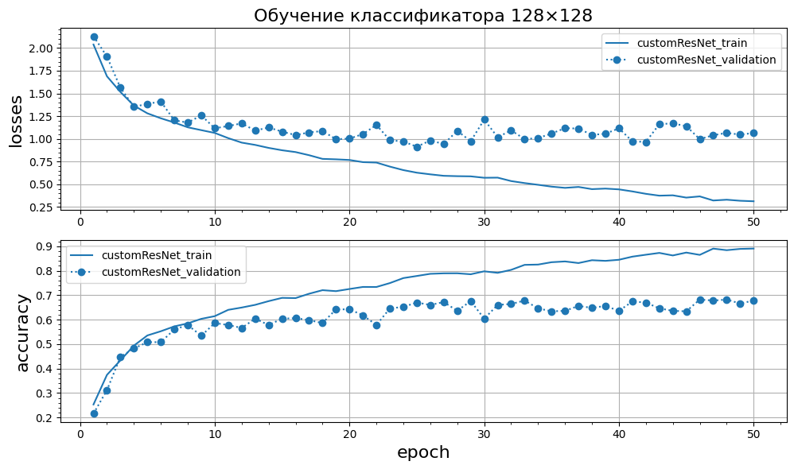
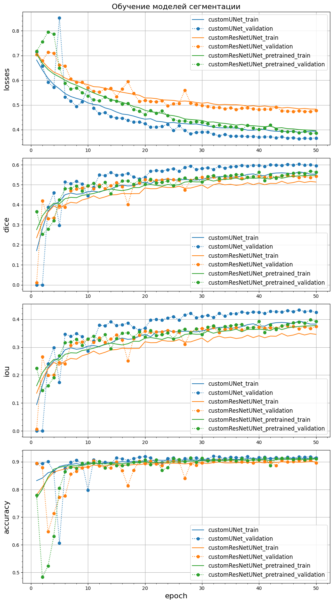
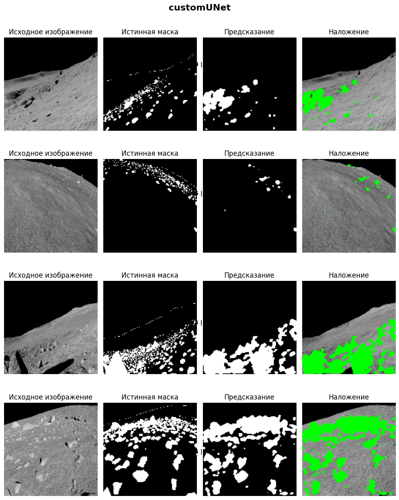
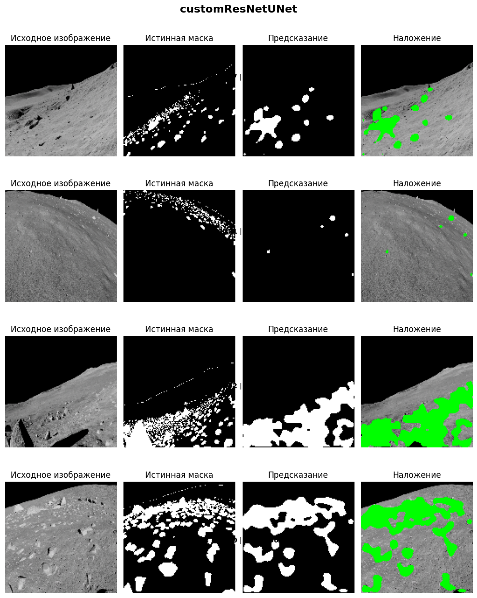
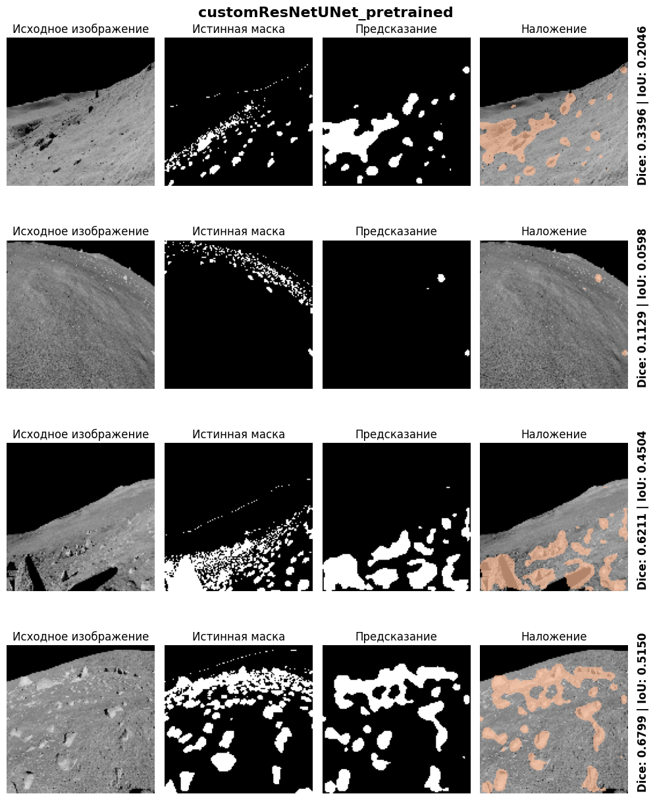

# Классификация 128x128 + U-Net c бэкбоном

Логи обучения хранятся в [train_logs](train_logs).

Графики построены в [main_notebook.ipynb](main_notebook.ipynb).

## Датасеты

### Tiny ImageNet-200
Создан датакласс [TinyImageNetDataset.py](src/datasets/TinyImageNetDataset.py), наследующий от `torch.utils.data.Dataset` следующие методы:
- `__init__`: инициализация путей к изображениям и аннотациям по выбранным классам и `train`/`val`;
- `__len__`: возврат количества примеров в датасете;
- `__getitem__`: загрузка и возврат одного примера (изображение + метка).

### MOON_SEGMENTATION_BINARY
Создан датакласс [MoonSegmentBinaryDataset.py](src/datasets/MoonSegmentBinaryDataset.py), наследующий от `torch.utils.data.Dataset` следующие методы:
- `__init__`: инициализация путей к изображениям и маскам;
- `__len__`: возврат количества примеров в датасете;
- `__getitem__`: загрузка и возврат одного примера (изображение + маска).

## Часть 1. Классификатор 128×128

В основу классификатора положена .

В этом проекте использована доработанная версия архитектуры классификатора из проекта [ResNet18](https://github.com/romangorbunov91/ResNet18). В [customResNet.py](src/models/customResNet.py) реализована функция с возможностью инициализации архитектуры модели под следующие входные параметры:
- `layers_config: List[int]` - слои модели в формате списка; например, `[2, 2, 2, 2]`;
- `in_channels: int` - количество входных каналов; например, для RGB-картинок `in_channels=3`;
- `layer0_channels: int` - количество каналов на входе первого базового слоя; например, `layer0_channels=18`;
- `num_classes: int` - количество классов на выходе; например, `num_classes=10`;
- `pretrained: bool` - флаг загрузки весов предобученной модели;
- `checkpoints_file: Union[str, Path]` - путь к `*.pth`-файлу весов предобученной модели.

Классификатор настроен на следующие параметры:
- слои модели: `layers_config=[2, 2, 2, 2]` (`"layers_num": 4`, `"block_size": 2`);
- функция активации: `activation=ReLU`;
- количество каналов на входе первого базового слоя: `layer0_channels=18`;
- каналы: `[18, 36, 72, 144]`;
- количество параметров модели: **889 732**.

Количество каналов `[18, 36, 72, 144]` соответствует декодеру в создаваемой U-Net.

Модель обучена на `Tiny ImageNet-200`, количество классов: `num_classes=10`.

Train-аугментации:
- `Resize --> RandomResizedCrop`;
- `RandomHorizontalFlip`;
- `RandomRotation`;
- `ColorJitter`.

```
self.train_transforms = transforms.Compose([
  transforms.Resize(tuple([int(img_size[1] * 1.125)]*2)),
  transforms.RandomResizedCrop(mdl_img_size[1], scale=(0.8, 1.0)),
  transforms.RandomHorizontalFlip(p=0.5),
  transforms.RandomRotation(10),
  transforms.ColorJitter(brightness=0.2, contrast=0.2, saturation=0.2, hue=0.1),
  transforms.ToTensor(),
  normalize,
])

self.val_transforms = transforms.Compose([
    transforms.Resize(tuple(mdl_img_size[1:])),
    transforms.ToTensor(),
    normalize,
])
```
где `mdl_img_size = [3, 128, 128]` (изображения приводятся из 64x64 к размеру 128×128).

Обучение реализовано в [train.py](src/train.py) в виде класса `ResNetTrainer` со следующими методами:
- `__init__` - инициализация переменных класса в соответствии с гиперпараметрами из файла конфигурации модели;
- `init_model` - установка функции ошибки, инициализация/загрузка модели, загрузка датасета;
- `__train` - обучение по батчам;
- `__val` - валидация по батчам;
- `train` - основной цикл обучения/валидации по эпохам.

Работа с метриками и логами выстроена через класс `MetricsHistory` на основе `AverageMeter` из [metrics.py](src/utils/metrics.py).

Гиперпараметры задаются в файле [customResNet-config.json](src/hyperparameters/customResNet-config.json).

Рекомендуется работать с моделью из терминала посредством [main.py](src/main.py).
```
python -m src.main --hypes src\hyperparameters\customResNet-config.json
```
или
```
python -m src.main --hypes src\hyperparameters\customResNet-config.json --resume checkpoints\backbones\best_customResNet.pth
```

<p align="center" width="100%">
  
</p>

## Часть 2. Базовая U-Net на "Луне"

[customUNet](src/models/customUNet.py) в конфигурации:
- каналы: `[18, 36, 72, 144]`;
- функция активации: `activation=ReLU`;
- количество параметров модели: **2 459 719**.

Размер каналов подстроен под требование ~2.5M±10% параметров.

Обучение реализовано в [train.py](src/train.py) в виде класса `UNetTrainer`.

Гиперпараметры задаются в файле [customUNet-config.json](src/hyperparameters/customUNet-config.json).

Рекомендуется работать с моделью из терминала посредством [main.py](src/main.py).
```
python -m src.main --hypes src\hyperparameters\customUNet-config.json
```
или
```
python -m src.main --hypes src\hyperparameters\customUNet-config.json --resume checkpoints\best_customUNet.pth
```

## Часть 3. U-Net с бэкбоном из классификатора

num_classes = None - убирает голову модели.

[customResNetUNet](src/models/customResNetUNet.py) в конфигурации:
- каналы: `[18, 36, 72, 144]`;
- функция активации: `activation=ReLU`;
- backbone: `customResNet`;
- количество параметров модели: **2 963 395**.

Обучение реализовано в [train.py](src/train.py) в виде класса `UNetTrainer`.

Гиперпараметры задаются в файле [customResNetUNet-config.json](src/hyperparameters/customResNetUNet-config.json).

Рекомендуется работать с моделью из терминала посредством [main.py](src/main.py).

```
python -m src.main --hypes src\hyperparameters\customResNetUNet-config.json
```
или
```
python -m src.main --hypes src\hyperparameters\customResNetUNet-config.json --resume checkpoints\best_customResNetUNet.pth
```

## Сравнение моделей сегментации

| Архитектура          | Модель           | Параметры | Предобуч. | Best Epoch (BE) | Val Loss @ BE | Val Dice @ BE | Val IoU @ BE | Val Accuracy @ BE |
|----------------------|------------------|-----------|-----------|-----------------|---------------|---------------|--------------|-------------------|
| **U-Net**            | customUNet       | 2.5M      | нет       | 47              | 36.3%         | 60.4%         | 43.3%        | 91.8%             |
| **U-Net + backbone** | customResNetUNet | 3.0M      | нет       | 45              | 47.5%         | 54.6%         | 37.6%        | 90.0%             |
| **U-Net + backbone** | customResNetUNet | 3.0M      | да        | 49              | 38.5%         | 56.9%         | 39.8%        | 91.3%             |

<p align="center" width="100%">
  
</p>

# Выводы
- Исходя из ограничения в ~2.5M±10% параметров количество каналов на выходе энкодера потребовалось уменьшить до 144. Следовательно, backbone-классификатор построен в конфигурации `[18, 36, 72, 144]`.
- Лучшие метрики на валидации продемонстрировала архитектура U-Net без бэкбона. 
- Предобученная архитектура с бэкбоном продемонстрировала лучшую динамику обучения, по сравнению с непредобученной.

## Reference
- [Полный текст задания](https://github.com/physicorym/designing_neural_network_architectures_2025_01/tree/main/seminar_03)

## Приложения
### Визуализации масок

<p align="center" width="100%">
  
</p>

<p align="center" width="100%">
  
</p>

<p align="center" width="100%">
  
</p>

### Работа с проектом
#### 1. Скачайте файлы репозитория
#### 2. Скачайте датасеты
- [tiny-imagenet-200](https://disk.yandex.ru/d/adWo9fVCLuVQ0Q)
- [moon-segmentation-binary](https://disk.yandex.ru/d/bJ6-fjDlVZBNfQ)
#### 3. Создайте окружение в директории `.venv`
```
python -m venv .venv
```
#### 4. Активируйте окружение
```
.venv\Scripts\activate
```
#### 5. Установите библиотеки
```
pip install -r requirements.txt
```

### Конфигурирование проекта

Общие гиперпараметры задаются в файле [config.json](src/hyperparameters/config.json), включая:
- `data_dir: str` - каталог с датасетами;
- `checkpoints_dir: str` - каталог с файлами весов моделей;
- `backbone_model_dir: str` - каталог с файлами весов backbone-моделей;
- `logs_dir: str` - каталог с логами моделей;,
- `device` - `cuda`, `cpu`;
- `seed: int`.